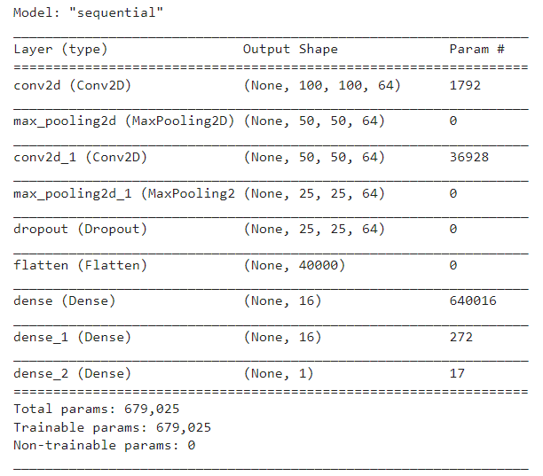
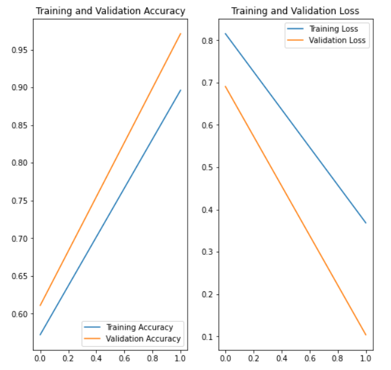
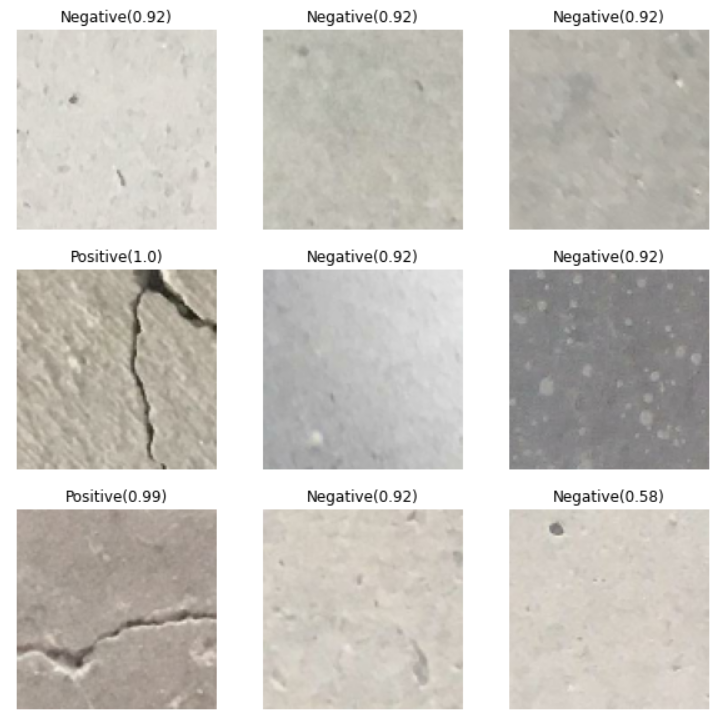

# Surface Crack detection using CNN

Crack detection is one of the most vital hyperlinks of concrete shape preservation, and it without delay reflects how safe, long lasting, and relevant the concrete structure is. This project is an effort to detect surface cracks automatically without human interference. It is based on Convolutional Neural Net Architecture(CNN)and is built using Tensorflow. To read research paper accompanying it [click here](./Crack%20Detection%20Research%20Paper.pdf)

## Dataset Used

Dataset used for training CNN was obtained from kaggle. The data sets contain images of various cracks with and without cracks. Image data is divided into negative (non-split) and compulsory (split) in separate image segmentation. Each class has 20000 images with a total of 40000 images with 227 x 227 pixels and RGB channels. Database is generated in 458 high resolution images (4032x3024 pixels) in the manner proposed by Zhang et al (2016).

## CNN Model

Model has in total 679,025 trainable parameters. Making it sufficiently large to learn the simple task of classifying cracked surfaces.

## Training

CNN is trained on 32000 images of cracked and uncracked surface images. Adam optimizer is used for training along with binary cross entropy as loss function and accuracy to measure performance. After training the model for 2 epochs, an accuracy of 97.1% is achieved on validation dataset. Validation loss is minimized to 0.104.

## Predictions

